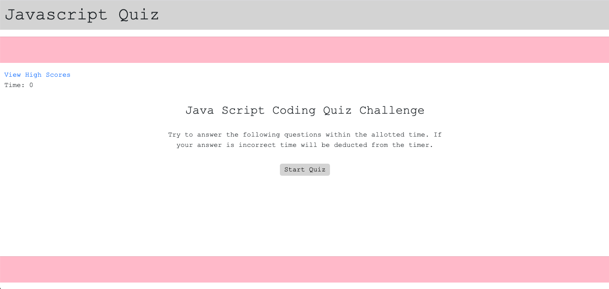

# code-quiz

Try the javascript code quiz application at:
[code-quiz](https://valeriehill75.github.io/code-quiz/)

This app uses html, css styling along with a Bootstrap link for readability on any size browser, and javascript. Upon clicking the Start Quiz button, the user is presented with five quiz questions testing the user's knowledge on Javascript. A timer is started upon beginning the quiz. Wrong answers will take time off the timer. High score information is collected and displayed on the High Score page.

